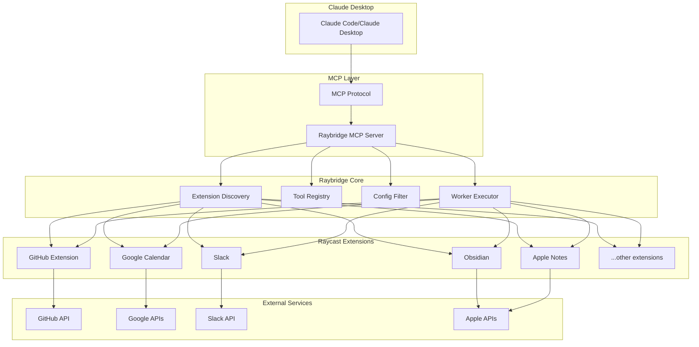
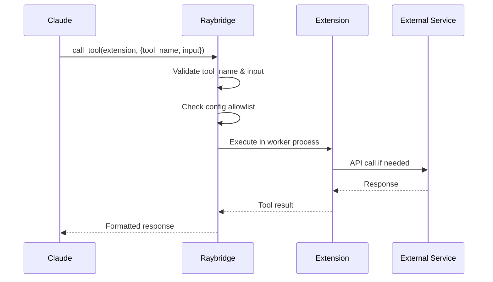

# Raybridge Architecture & Optimization Guide

## 🎯 Executive Summary

Raybridge is an MCP (Model Context Protocol) server that exposes Raycast extension tools to AI assistants like Claude. It acts as a bridge between Raycast's rich ecosystem of extensions and MCP clients.

## 📊 Current State Analysis

### Active Extensions (16/72 tools enabled)
| Extension | Tools | Status | Notes |
|-----------|-------|--------|-------|
| github | 9 tools | ✅ Active | Full GitHub automation |
| github-copilot | 2 tools | ✅ Active | Copilot task management |
| google-calendar | 8 tools | ✅ Active | Calendar management |
| google-workspace | 2 tools | ✅ Active | Drive operations |
| slack | 6 tools | ✅ Active | Team communication |
| obsidian | 7 tools | ✅ Active | Note management |
| apple-notes | 4 tools | ✅ Active | Native notes |
| apple-reminders | 6 tools | ✅ Active | Task management |
| kill-process | 2 tools | ✅ Active | System control |
| arc | 6 tools | ✅ Active | Browser automation |
| downloads-manager | 4 tools | ✅ Active | File operations |
| video-downloader | 2 tools | ✅ Active | Media handling |
| base64 | 2 tools | ✅ Active | Encoding utilities |
| shodan-raybridge | 5 tools | ⚠️ Needs API Key | Security scanning |
| xcode | 5 tools | ✅ Active | Development tools |
| svgl | 2 tools | ✅ Active | SVG resources |

### Disabled Extensions
- ccusage (usage stats - not needed)
- music (Apple Music control - optional)
- sips (image manipulation - optional)
- media-converter (file conversion - optional)
- timers (time tracking - optional)
- pomodoro (productivity - optional)
- mcp (meta tool - rarely needed)

## 🏗️ Architecture Overview



## 🔧 Tool Execution Flow



## 📋 Configuration Structure

### Primary Config: `~/.config/raybridge/tools.json`
```json
{
  "mode": "allowlist",           // Security model
  "raycastApi": {               // API capabilities
    "enableLocalStorage": true,
    "enableClipboard": true,
    "enableSystemActions": true,
    "enableDestructiveSystemActions": false
  },
  "extensions": {               // Per-extension config
    "github": {
      "enabled": true,
      "tools": ["specific-tools"]  // Optional tool whitelist
    }
  }
}
```

### Preferences: `~/.config/raybridge/preferences.json`
```json
{
  "shodan-raybridge": {
    "apiKey": "your-shodan-key"
  }
}
```

## 🚀 Optimization Recommendations

### 1. Remove Unnecessary Dependencies

Current package.json has some heavy dependencies:
- `@opentui/core` & `@opentui/react` - UI components (possibly unused)
- `react` - Only needed if using UI components
- `express` - HTTP server (only needed for HTTP mode)

**Action**: Create a minimal profile without UI components

### 2. Streamline Extension Set

Your current setup is well-curated, but consider:
- **Keep**: All currently enabled (they're all useful)
- **Consider adding**: `music` if you want AI to control playback
- **Keep disabled**: `ccusage`, `timers`, `pomodoro`, `mcp`

### 3. Security Hardening

Your current config is good:
- ✅ Allowlist mode enabled
- ✅ Destructive system actions disabled
- ✅ AppleScript disabled
- ✅ Command launch disabled

### 4. Performance Optimizations

```typescript
// Add to config for performance
{
  "performance": {
    "workerPoolSize": 2,        // Limit concurrent workers
    "toolTimeout": 30000,       // 30s timeout per tool
    "extensionCacheTTL": 300000 // 5min cache for extensions
  }
}
```

## 🔐 Doppler Integration

### Option A: Wrap Entire Raybridge (Recommended)
```bash
# In Claude Desktop config
"raybridge": {
  "command": "doppler",
  "args": ["run", "--", "bun", "run", "/path/to/raybridge/src/index.ts"],
  "env": {
    "DOPPLER_PROJECT": "raybridge",
    "DOPPLER_CONFIG": "prod"
  }
}
```

### Option B: Wrap Only Script
```bash
# Less secure if secrets needed by bootstrap
"raybridge": {
  "command": "bun",
  "args": ["run", "src/index.ts"],
  "env": {
    "RAYBRIDGE_DOPPLER_CMD": "doppler run --"
  }
}
```

## 📊 Usage Patterns

### Most Useful Tools for Development
1. **GitHub** - PR management, issue tracking
2. **Obsidian** - Knowledge base operations
3. **Apple Notes** - Quick note creation
4. **Slack** - Team communication
5. **Google Calendar** - Meeting management

### Security-Sensitive Tools
- `kill-process` - System process control
- `apple-reminders` - Personal task management
- `downloads-manager` - File system access

## 🛠️ Maintenance Checklist

### Weekly
- [ ] Review extension updates
- [ ] Check for new tools in enabled extensions
- [ ] Rotate API keys if needed

### Monthly
- [ ] Audit enabled tools
- [ ] Review Raybridge logs
- [ ] Update dependencies

### Quarterly
- [ ] Full security audit
- [ ] Performance review
- [ ] Extension cleanup

## 🎯 Quick Start Commands

```bash
# Check Raybridge status
bun run raybridge doctor

# List all available tools
bun run raybridge list

# Test specific extension
bun run raybridge test github

# Reload configuration
bun run raybridge reload

# Start with logging
MCP_LOG=debug bun run src/index.ts
```

## 📈 Monitoring & Debugging

### Log Locations
- Raybridge logs: `raybridge.log`
- MCP client logs: Claude Desktop logs
- Extension logs: Individual extension logs

### Common Issues
1. **Tool timeouts** - Increase `toolTimeout` in config
2. **Permission errors** - Check Raycast permissions
3. **API rate limits** - Implement rate limiting
4. **Memory usage** - Limit worker pool size

## 🔮 Future Enhancements

1. **Tool batching** - Execute multiple tools in parallel
2. **Caching layer** - Cache API responses
3. **Rate limiting** - Prevent API abuse
4. **Tool composition** - Chain tools together
5. **Web UI** - Dashboard for managing Raybridge

---

*This document is a living guide. Update as your usage patterns evolve.*
