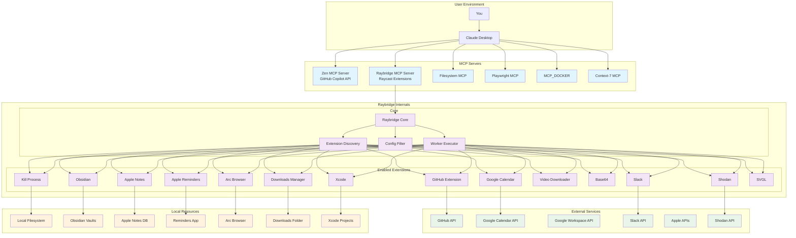
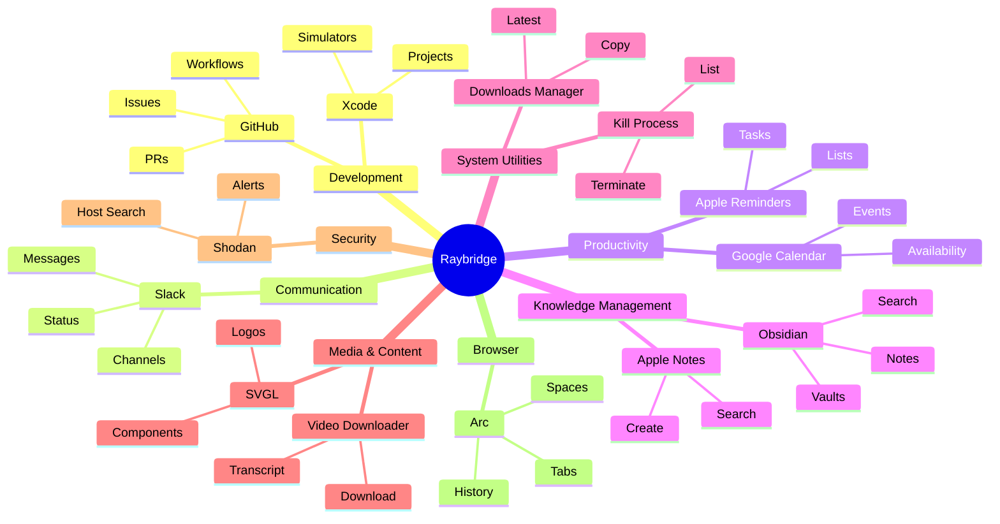
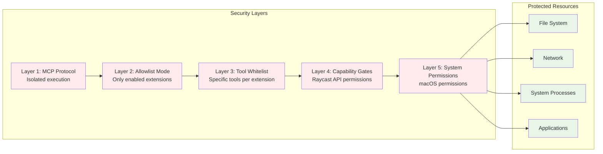
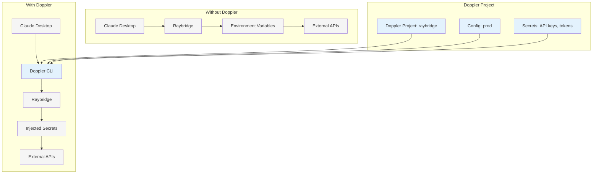

# Raybridge Visual Architecture Guide

## 🌐 Complete System Flow



## 🔄 Tool Execution Pattern

```mermaid
sequenceDiagram
    participant U as User
    participant CD as Claude Desktop
    participant RB as Raybridge
    participant CF as Config Filter
    participant EX as Extension
    participant API as External API
    
    U->>CD: "Create a GitHub issue"
    CD->>RB: call_tool("github", {
        tool_name: "create-issue",
        input: {repo, title, body}
    })
    
    RB->>CF: Check if github.enabled
    CF-->>RB: ✅ Allowed
    
    RB->>CF: Check if "create-issue" in tools
    CF-->>RB: ✅ Allowed
    
    RB->>EX: Execute create-issue
    EX->>API: POST /repos/{repo}/issues
    API-->>EX: Issue created
    EX-->>RB: Issue URL
    
    RB-->>CD: "Issue created: https://github.com/..."
    CD-->>U: "I've created the GitHub issue for you"
```

## 📊 Extension Categories



## 🔐 Security Model



## 🚀 Doppler Integration Flow



## 📈 Performance Characteristics

```mermaid
gantt
    title Raybridge Tool Execution Timeline
    dateFormat X
    axisFormat %s
    
    section Tool Call
    Request Validation   :0, 10ms
    Config Check        :10, 5ms
    Worker Spawn        :15, 50ms
    Extension Load      :65, 20ms
    API Call            :85, 200ms
    Response Process    :285, 10ms
    
    section Parallel Execution
    Tool 1 :0, 300
    Tool 2 :50, 350
    Tool 3 :100, 400
```



## 🎯 Usage Recommendations

### High-Value Extensions (Daily Use)
1. **GitHub** - Essential for development workflow
2. **Obsidian** - Knowledge management
3. **Slack** - Team communication
4. **Google Calendar** - Meeting management

### situational Extensions
1. **Apple Notes** - Quick notes when Obsidian is overkill
2. **Downloads Manager** - File management
3. **Base64** - Encoding/decoding utilities

### Advanced/Power User
1. **Shodan** - Security research (requires API key)
2. **Xcode** - iOS/macOS development
3. **Kill Process** - System administration

---

This visual guide helps you understand how Raybridge fits into your development ecosystem and how to leverage it effectively.
